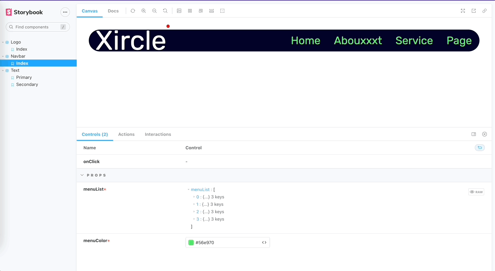

# vue3-ts-strorybook

## Project setup
```
npm install
```
## To Run Storybook
```
npm run storybook
```
## To Serve normal project with vite

```
npm run dev:vite
```



# By Sirawich Voungchuy. Enjoy krub ;)